# tema-std-kubernetes

Tema STD - WordPress + Chat + AI pe Kubernetes

-> Chat funcțional cu toate cerințele
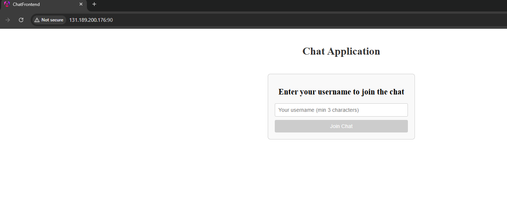
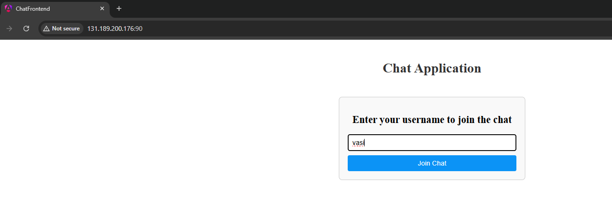
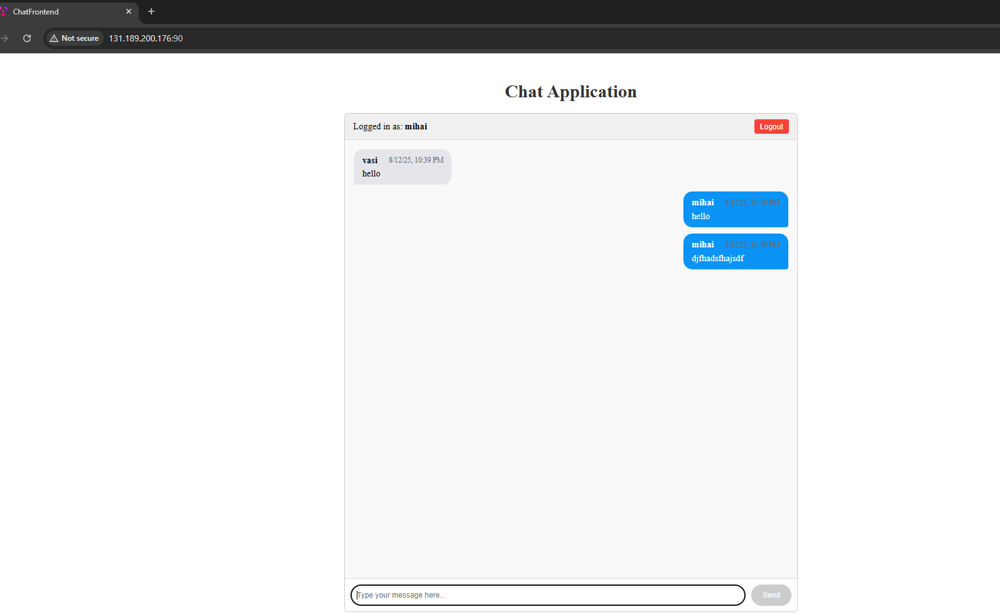
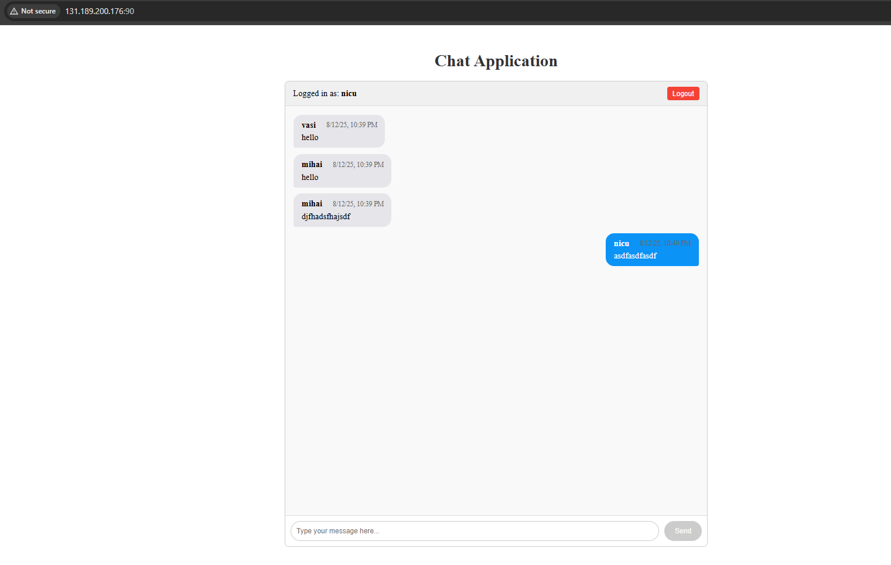

-> AI funcțional cu toate cerințele
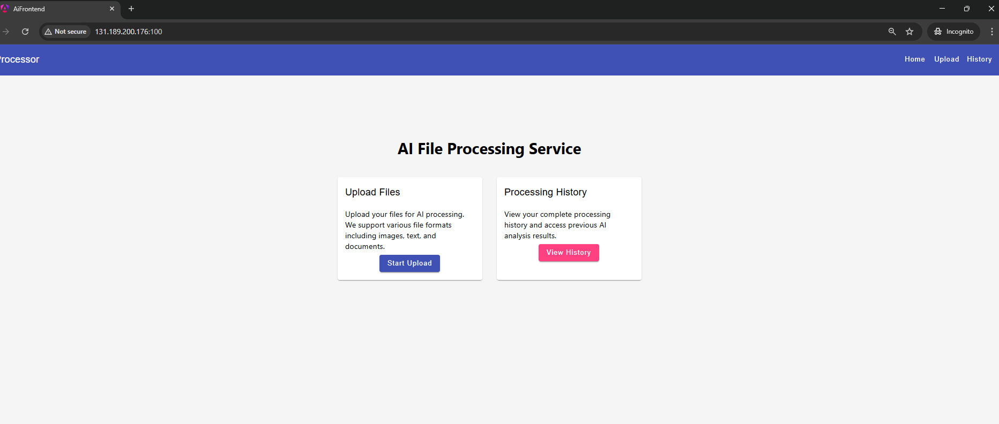
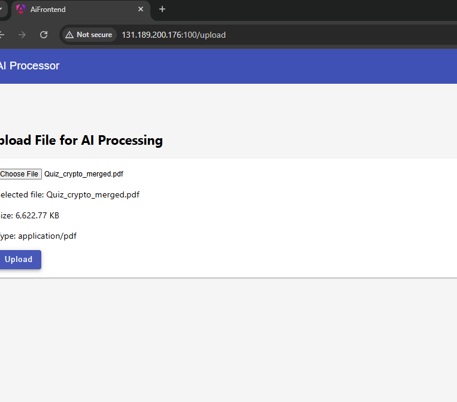
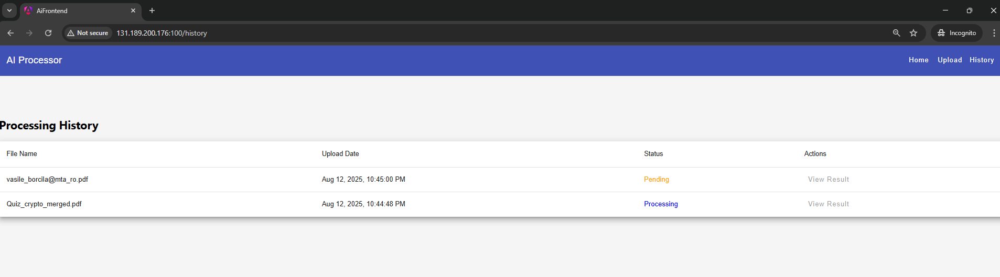

Punctele neîndeplinite ale CMS-ului:
-> După pornirea pod-urilor din cluster, la prima accesare din browser pe portul 80, este necesară:
-> crearea unui cont de administrator

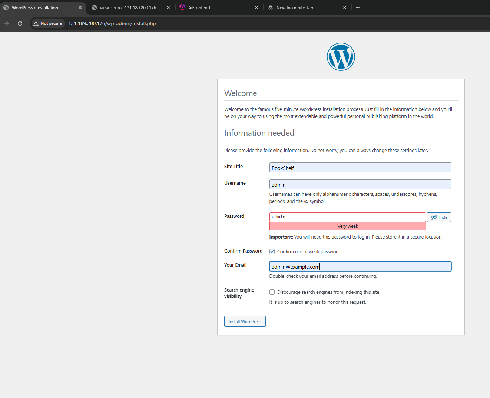
-> logarea cu credențialele create
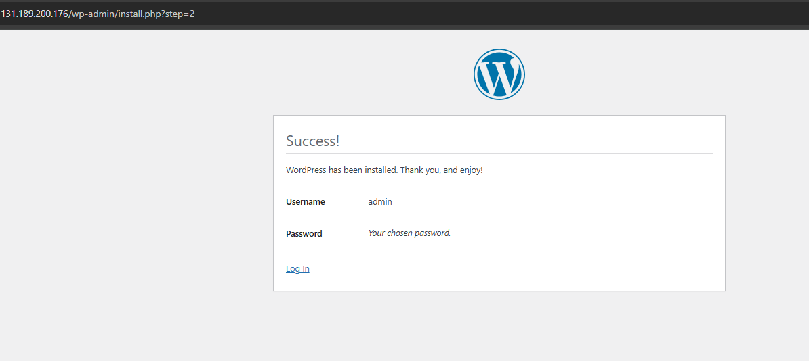
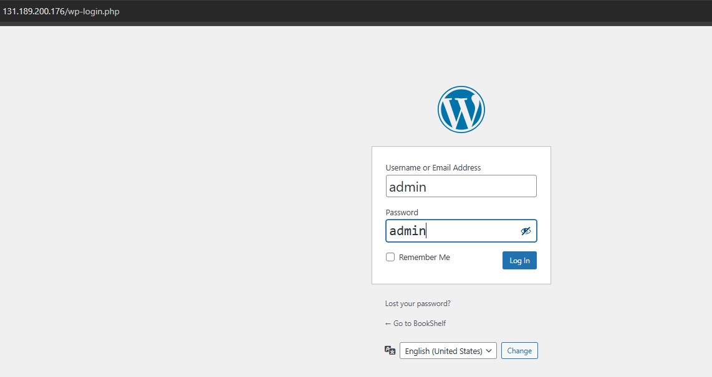
-> navigarea la Apeareance/Themes și activarea temei AI & Chat Theme
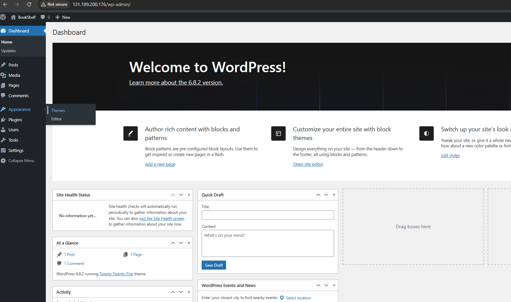

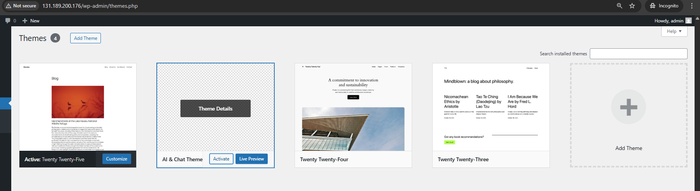

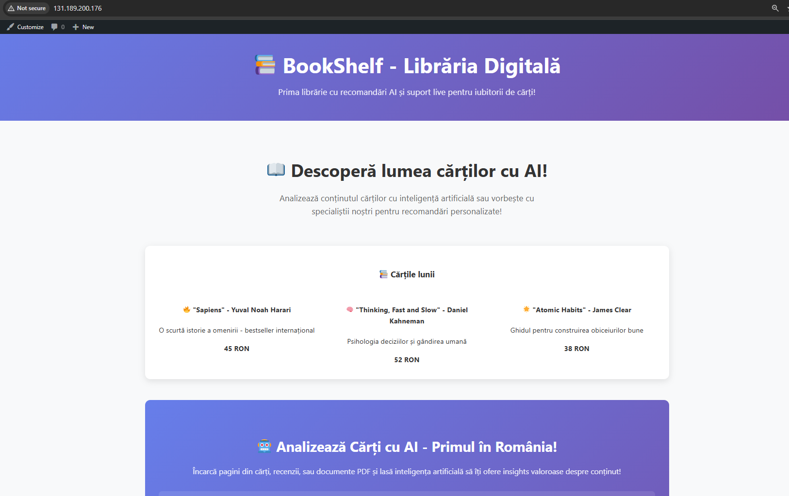

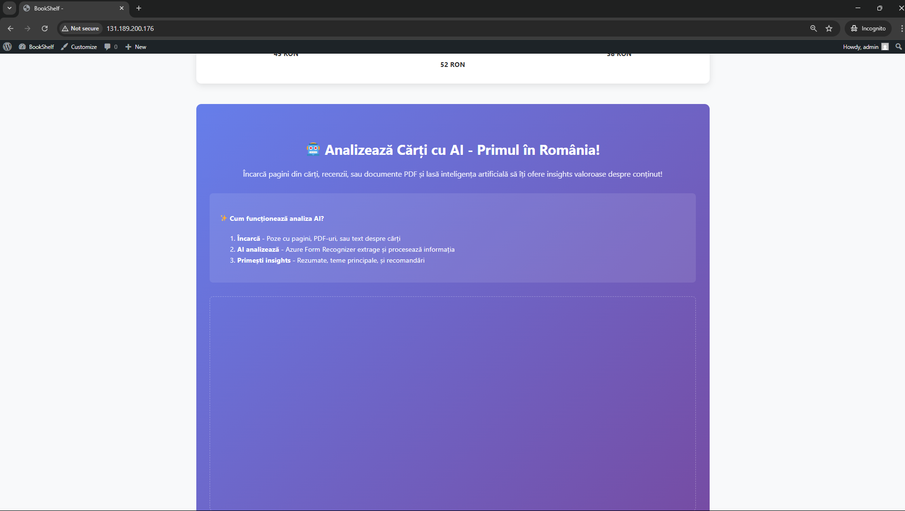
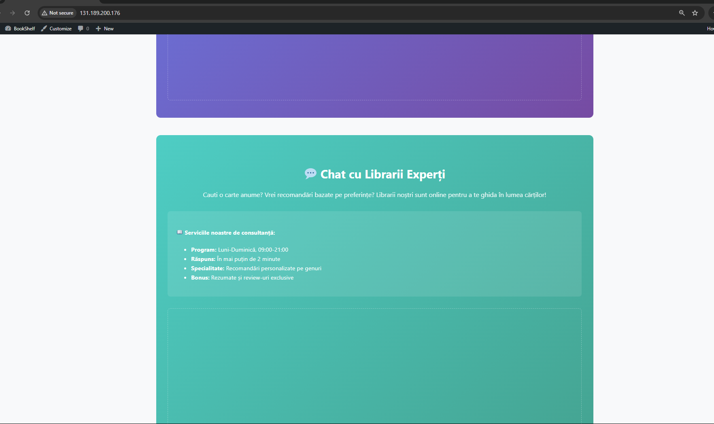

Dar problema aici e că nu pot prelua în mod automat adresa IP a VM-ului pentru a putea accesa serviciile de chat și AI.

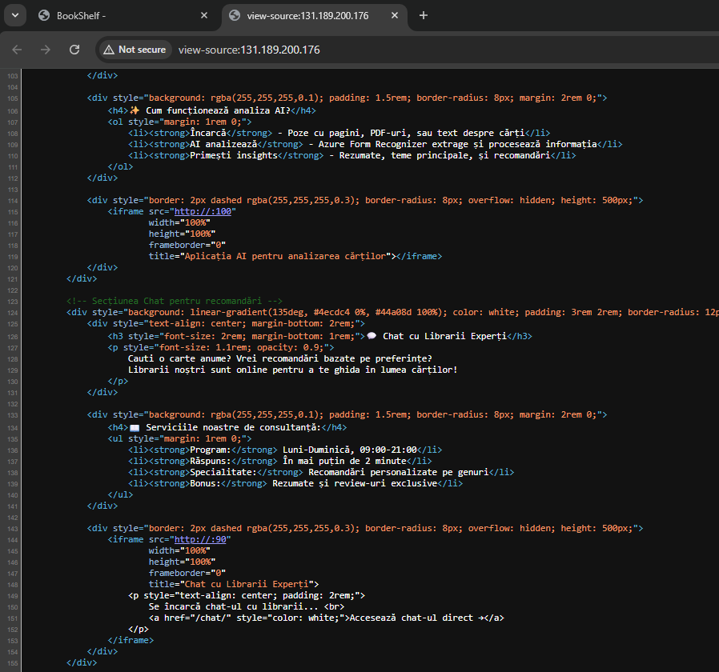
