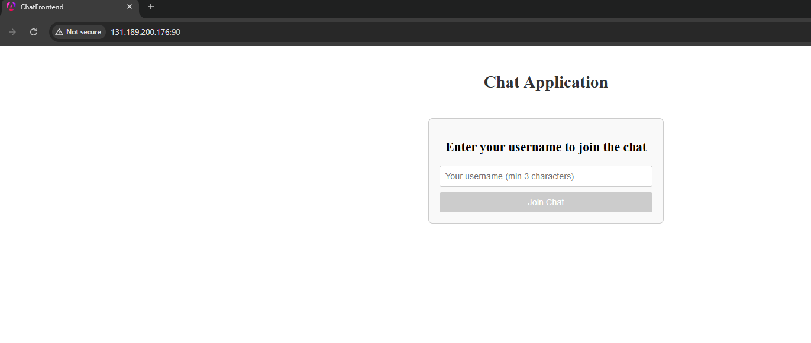
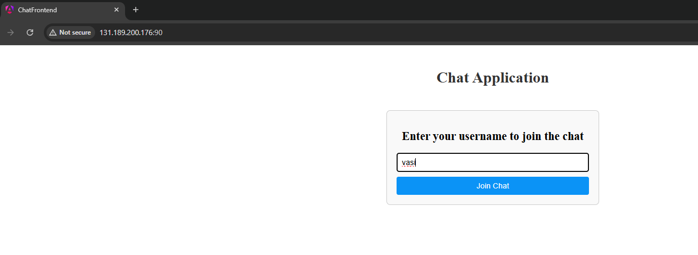
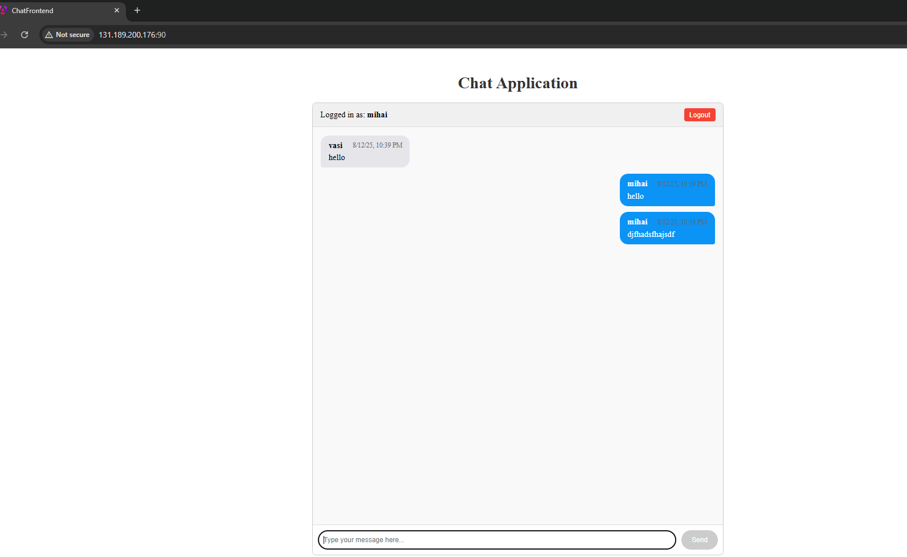
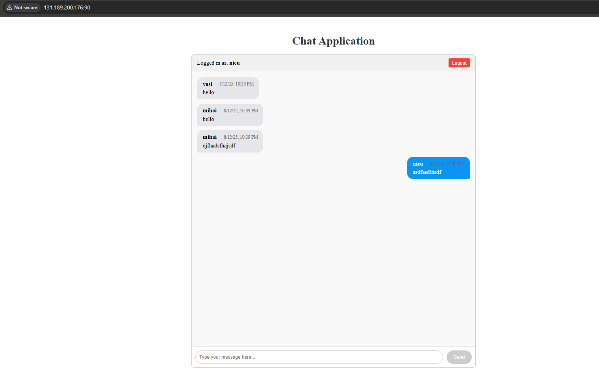
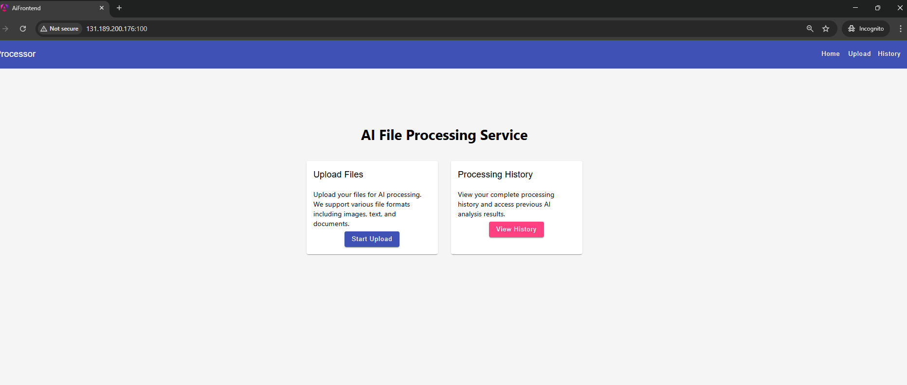
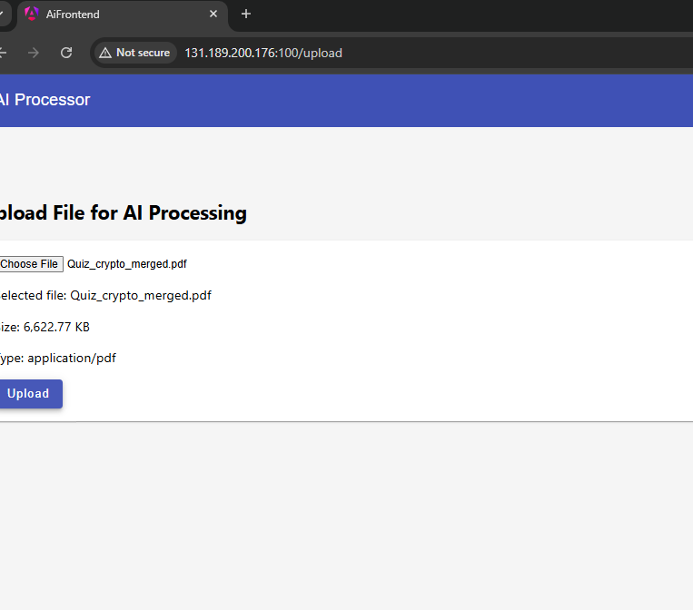
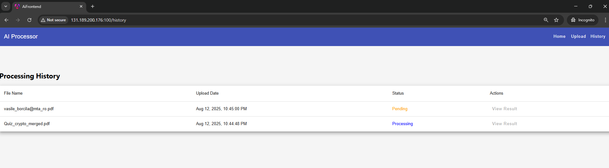
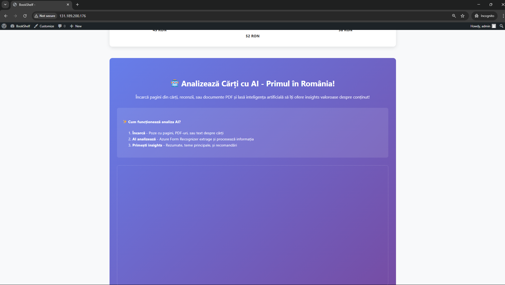
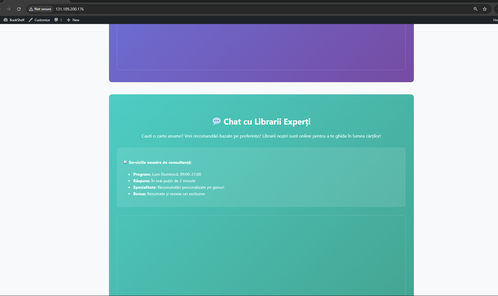
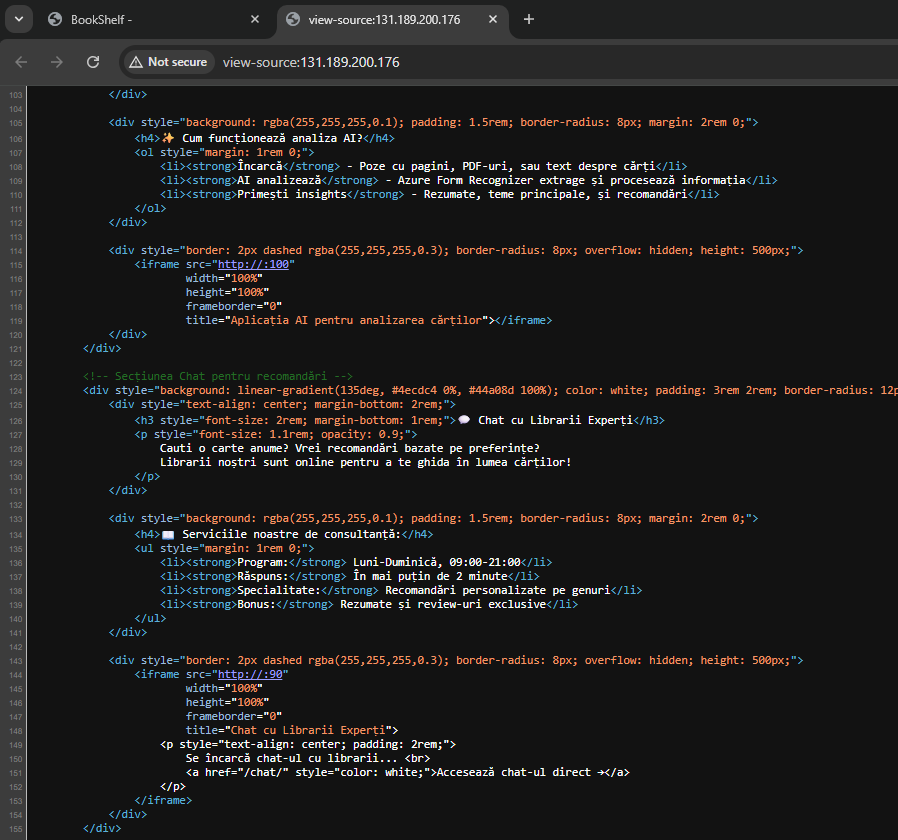

# Tema STD — Site Web cu Chat și IA peste Kubernetes

**Student:** Borcilă Vasile  
**Materie:** Sisteme Tolerante la Defecte

---

## Descriere

Aplicație web completă care integrează un **CMS WordPress**, un **sistem de chat real-time** și o **aplicație de IA (Form Recognizer)**, toate orchestrate printr-un cluster Kubernetes cu 2 noduri (master + worker) pe Azure VMs.

---

## Arhitectură

```
                    ┌─────────────────────────────────────────────────┐
                    │            Nginx Ingress Controller             │
                    │                  (port 80)                      │
                    ├──────────┬──────────┬───────────┬───────────────┤
                    │  /       │  /ai/*   │  /chat/*  │  /chatapi/*   │
                    ▼          ▼          ▼           ▼               │
               WordPress   AI Frontend  Chat Frontend  Chat Backend  │
               (2 replici)  (Angular)   (Angular)      (Go+Nginx)    │
                    │          │          │           │               │
                    ▼          ▼          │           ▼               │
                  MySQL    AI Backend     │        MongoDB            │
                           (Node.js)      │        Redis              │
                              │           │    (cross-pod sync)       │
                    ┌─────────┘           │                           │
                    ▼                     │                           │
              Azure Services              │                           │
          ┌────────┬──────────┐           │                           │
          │ Blob   │ Form     │           │                           │
          │Storage │Recognizer│           │                           │
          │        │          │           │                           │
          │  Azure SQL DB     │           │                           │
          └───────────────────┘           │                           │
                                          │                           │
                    ┌─────────────────────┘                           │
                    │     Private Registry (registry:2)               │
                    │     ClusterIP: 10.96.100.100:5000               │
                    │     NodePort: 30500                             │
                    └─────────────────────────────────────────────────┘
```

---

## Componente implementate

### 1. WordPress CMS (port 80)
- **Imagine:** Custom `wordpress` — include tema „AI & Chat Theme" pre-instalată
- **Replici:** 2
- **Bază de date:** MySQL 8.0 cu date persistente (PVC)
- **Auto-configurare:** Script `init-wordpress.sh` baked în imagine — instalare automată WordPress, activare temă, configurare URL-uri
- **Integrare:** Chat-ul și AI-ul sunt integrate prin iframe-uri în tema CMS
- **După `kubectl apply`:** Totul funcționează automat, fără configurare manuală

### 2. Sistem de Chat (porturi 88 + 90)
- **Backend:** Go cu WebSocket (`gorilla/websocket`) — port 88, **2 replici**
- **Frontend:** Angular 19 — port 90, **1 replică**
- **Bază de date:** MongoDB pentru stocarea mesajelor (nume utilizator, text ASCII, timestamp)
- **Sincronizare cross-pod:** Redis Pub/Sub pentru a sincroniza mesajele între cele 2 replici de chat-backend
- **Protocol:** WebSocket pentru comunicare real-time
- **Funcționalități:**
  - Formular de trimitere mesaj cu buton
  - Afișare mesaje din trecut (din MongoDB) în ordine cronologică
  - Reconectare automată WebSocket la fiecare 3 secunde
  - Integrat în WordPress prin iframe

### 3. Aplicația de IA — Form Recognizer (port 100/3000)
- **Backend:** Node.js/Express — port 3000, **1 replică**
- **Frontend:** Angular 19 — port 80, **1 replică**
- **Serviciu Azure:** Document Intelligence (Form Recognizer)
- **Stocare:** Azure Blob Storage pentru fișiere uploadate
- **Bază de date:** Azure SQL Database pentru metadata (nume, adresă blob, timestamp, rezultat)
- **Funcționalități:**
  - Upload fișiere (PDF, imagini) pentru procesare OCR
  - Vizualizare rezultat procesare (text extras, tabele, câmpuri detectate)
  - Istoric complet al cererilor cu rezultatele obținute
  - Integrat în WordPress prin iframe

### 4. Registry Privat (addon)
- **Imagine:** `registry:2`
- **Stocare:** `hostPath` la `/opt/registry-data` — persistentă pe disk (nu se pierde la restart)
- **Acces intern:** ClusterIP fix `10.96.100.100:5000`
- **Acces extern:** NodePort `30500` (pentru push de pe laptop)
- **Toate cele 5 imagini custom** sunt stocate în registry-ul privat

---

## Structura proiectului

```
tema-std-kubernetes/
├── ai-backend/              # Backend IA (Node.js + Express)
│   ├── Dockerfile           # Multi-stage build
│   ├── config/database.js   # Conexiune Azure SQL
│   ├── routes/              # API endpoints
│   └── services/            # Azure Form Recognizer + Blob Storage
│
├── ai-frontend/             # Frontend IA (Angular 19)
│   ├── Dockerfile           # Multi-stage: build Angular + serve cu Nginx
│   └── src/app/
│       ├── components/      # Upload, History, ResultDetail
│       └── services/        # API service
│
├── chat-backend/            # Backend Chat (Go)
│   ├── Dockerfile           # Multi-stage: compile Go + Alpine runtime
│   ├── main.go              # HTTP server + WebSocket handlers
│   ├── handlers/chat.go     # WebSocket upgrade + message broadcast
│   ├── ws/websocket.go      # Connection pool + Redis pub/sub
│   └── models/              # Message + User models (MongoDB)
│
├── chat-frontend/           # Frontend Chat (Angular 19)
│   ├── Dockerfile           # Multi-stage: build Angular + serve cu Nginx
│   └── src/app/
│       ├── components/chat/  # Componenta de chat
│       └── services/         # WebSocket + HTTP service
│
├── wordpress/               # WordPress custom
│   ├── Dockerfile           # WordPress + temă + script auto-config
│   ├── init-wordpress.sh    # Instalare automată + activare temă
│   └── wp-content/themes/   # Tema "AI & Chat Theme"
│
├── kubernetes/              # Manifeste Kubernetes (kubectl apply -f --recursive)
│   ├── aa_namespace.yaml    # Namespace "tema-std"
│   ├── azure_secrets.yaml   # Secreturi Azure (connection strings, API keys)
│   ├── ingress.yaml         # 3 Ingress resources (app, chatapi, wordpress)
│   ├── metallb.yaml         # MetalLB config
│   ├── ai-backend/          # Deployment + Service (port 3000)
│   ├── ai-frontend/         # Deployment + Service (port 80)
│   ├── chat-backend/        # Deployment + Service (port 88)
│   ├── chat-frontend/       # Deployment + Service (port 90)
│   ├── mongodb/             # Deployment + Service + PVC
│   ├── mysql/               # Deployment + Service + PVC + Secret
│   └── wordpress/           # Deployment + Service + PVC + Redis
│
└── registry-addon.yaml      # Registry privat (deploy separat, ca addon)
```

---

## Pregătirea clusterului (o singură dată)

### 1. VMs Azure
- **k8s-master** — control plane (kubeadm init)
- **k8s-worker** — worker node (kubeadm join)

### 2. Addon-uri pre-instalate
```bash
# Nginx Ingress Controller (DaemonSet)
kubectl apply -f https://raw.githubusercontent.com/kubernetes/ingress-nginx/controller-v1.12.0/deploy/static/provider/baremetal/deploy.yaml

# permite annotation-uri custom în Ingress
kubectl -n ingress-nginx patch configmap ingress-nginx-controller \
  --type=merge -p='{"data":{"allow-snippet-annotations":"true"}}'

# Registry privat (addon separat)
kubectl apply -f registry-addon.yaml
```

### 3. Containerd config pe ambele noduri
```bash
# Configurare mirror pentru registry privat
sudo bash -c 'cat >> /etc/containerd/config.toml <<EOF

[plugins."io.containerd.grpc.v1.cri".registry.mirrors."10.96.100.100:5000"]
  endpoint = ["http://10.96.100.100:5000"]
EOF'
sudo systemctl restart containerd
```

### 4. Build + push imagini în registry
```bash
# De pe laptop: build și push pe Docker Hub
docker build -t vasileborcila/temastd:ai-frontend ./ai-frontend
docker build -t vasileborcila/temastd:ai-backend ./ai-backend
docker build -t vasileborcila/temastd:chat-frontend ./chat-frontend
docker build -t vasileborcila/temastd:chat-backend ./chat-backend
docker build -t vasileborcila/temastd:wordpress ./wordpress
docker push vasileborcila/temastd --all-tags

# Pe master: copiere din Docker Hub în registry privat
for img in ai-frontend ai-backend chat-frontend chat-backend wordpress; do
  crane copy vasileborcila/temastd:$img 10.96.100.100:5000/$img:latest --insecure
done

# Verificare
curl http://10.96.100.100:5000/v2/_catalog
```

---

## Pornire (o singură comandă)

```bash
kubectl apply -f ~/kubernetes/ --recursive
```

Toate pod-urile pornesc, trag imaginile din registry-ul privat, iar aplicația este accesibilă la:
- **WordPress + CMS:** `http://<VM_IP>/`
- **Chat:** `http://<VM_IP>/chat/`
- **Aplicația IA:** `http://<VM_IP>/ai/`
- **Chat API/WebSocket:** `http://<VM_IP>/chatapi/ws`

---

## Prezentare

### Flow prezentare:
```bash
# 1. Arată cluster gol (addon-urile rămân active)
kubectl delete -f ~/kubernetes/ --recursive

# 2. Verifică — sunt doar addon-urile
kubectl get all -n tema-std   # doar registry

# 3. Pornire dintr-o singură comandă
kubectl apply -f ~/kubernetes/ --recursive

# 4. Așteaptă pod-urile
kubectl get pods -n tema-std -w

# 5. Accesează site-ul — totul funcționează automat
# http://<VM_IP>/
```

### Ce funcționează automat (fără configurare post-apply):
- ✅ WordPress instalat cu admin, temă activată, URL-uri configurate
- ✅ Chat funcțional cu WebSocket, Redis sync, MongoDB persistence
- ✅ AI funcțional cu upload, Form Recognizer, Blob Storage, SQL DB
- ✅ Toate integrate în CMS prin iframe-uri
- ✅ Imagini custom din registry privat

---

## Tehnologii utilizate

| Componentă | Tehnologie | Cerință temă |
|-----------|-----------|-------------|
| CMS | WordPress | ✅ WordPress cu 2 replici |
| Chat Backend | Go + Nginx (Ingress) | ✅ Go+Nginx cu 2 replici |
| Chat Frontend | Angular 19 | ✅ Angular cu 1 replică |
| Chat DB | MongoDB | ✅ Stocare mesaje |
| Chat Sync | Redis Pub/Sub | ✅ Sincronizare cross-pod |
| AI Frontend | Angular 19 | ✅ Angular cu 1 replică |
| AI Backend | Node.js/Express | ✅ Backend procesare |
| AI Service | Azure Form Recognizer | ✅ Form Recognizer |
| AI Storage | Azure Blob Storage | ✅ Fișiere în blob |
| AI Database | Azure SQL Database | ✅ Metadata în SQL |
| CMS DB | MySQL 8.0 | ✅ Bază de date CMS |
| Registry | registry:2 (privat) | ✅ Registry privat cluster |
| Ingress | Nginx Ingress Controller | ✅ Expunere pe portul 80 |
| Orchestrare | Kubernetes (2 noduri) | ✅ Cluster K8s |

---

## Imagini custom (registry privat)

Toate cele 5 imagini custom sunt stocate în **registry-ul privat** al clusterului (`10.96.100.100:5000`):

| Imagine | Dockerfile | Descriere |
|---------|-----------|-----------|
| `ai-frontend` | Multi-stage: Node 18 → Nginx Alpine | Angular build + Nginx serve |
| `ai-backend` | Multi-stage: Node 18 → Node 18 slim | Express API server |
| `chat-frontend` | Multi-stage: Node 18 → Nginx Alpine | Angular build + Nginx serve (port 90) |
| `chat-backend` | Multi-stage: Go 1.24 → Alpine 3.17 | Go binary compilat static |
| `wordpress` | WordPress base + temă + script init | Auto-configurare completă |

---

## Screenshots

### Chat funcțional





### AI funcțional




### WordPress CMS cu integrare



